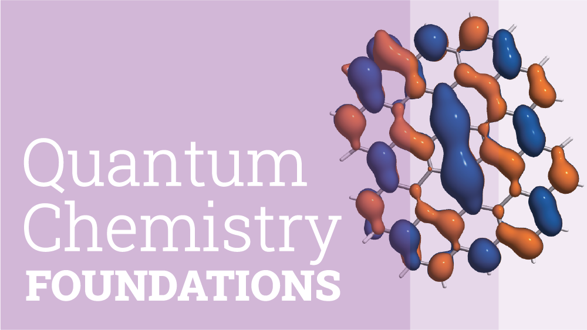

## In brief

**Content**: A step-by-step introduction to quantum chemistry concepts and writing scientific software.

**Target audience**: Students interested in learning more about quantum chemistry.

**Prerequisites**: Basic Python knowledge and some exposure to quantum mechanics or physical chemistry.

**Author**: Francesco A. Evangelista

## Description

**Quantum Chemistry Foundations** is a series of tutorials that explore some of the most important ideas of quantum chemistry.
In these tutorials, you will learn about quantum chemistry from a computational perspective, which I think is a very effective complement to a detailed study of each method's formal aspects.

These tutorials assume some basic knowledge of quantum mechanics and programming in Python. You can read the Jupyter notebooks on GitHub, download and run them locally on your computer, or run them via [Google's Colab](https://colab.research.google.com/github/fevangelista/Quantum-Chemistry-Foundations) without having to install Python and Jupyter on your computer.

## Tutorials

The following is a list of sections that form the **Quantum Chemistry Foundations** series.

- [01 - An introduction to scientific python](01-Scientific%20Computing/01-Scientific%20Computing.ipynb). A quick introduction to NumPy and other useful tools for scientific computing. This can be skipped if you are already familiar with NumPy.
- [02 - Hückel theory](02-Hückel%20Theory/02-Hückel%20Theory.ipynb). An introduction to Hückel theory and the concept of expanding molecular orbitals in a basis of atomic orbitals.
- [03 - Advanced Hückel theory: Properties](03-Hückel%20Theory%20Properties/03-Hückel%20Theory%20Properties.ipynb). This second tutorial on Hückel theory focuses on packaging a computational method into a class and an analysis of the charge and spin distribution and bond order. (🚧 **under construction** 🚧)

More tutorials and updates are on the way!

## Try Me on Colab

Use [the following link](https://colab.research.google.com/github/fevangelista/Quantum-Chemistry-Foundations) to access and execute the notebooks via Google's Colab.

## Support

This project is supported by the National Science Foundation under Award CHEM 2312105. Any opinions, findings, conclusions, or recommendations expressed in this material are those of the author(s) and do not necessarily reflect the views of the National Science Foundation.

## Reuse and Licensing

These notes are intended for non-commercial applications.
You can download, modify, and re-use them for learning, teaching, and research.
If you're planning to redistribute content from these tutorials, please credit this project and share your work under the same terms.

This work is licensed under <a href="https://creativecommons.org/licenses/by-nc-sa/4.0/?ref=chooser-v1" target="_blank" rel="license noopener noreferrer" style="display:inline-block;">CC BY-NC-SA 4.0</a>

